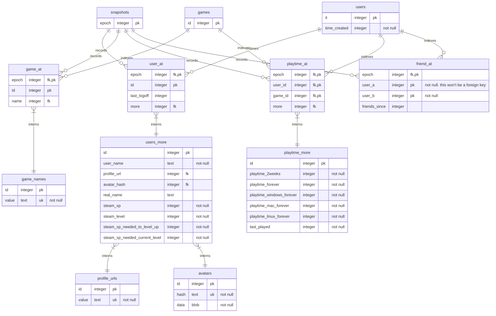

# Database 2.0.0

```mermaid
erDiagram
   snapshots {
      epoch integer pk
   }

   users {
      it integer pk
      time_created integer "not null"
   }

   snapshots ||--o{ user_at : records
   users ||--o{ user_at : indexes

   user_at {
      epoch integer fk,pk
      id integer pk

      last_logoff integer
      more integer fk
   }

   user_at }|--|| users_more : interns

   users_more {
      id integer pk

      user_name text "not null"
      profile_url integer fk
      avatar_hash integer fk
      real_name text

      steam_xp integer "not null"
      steam_level integer "not null"
      steam_xp_needed_to_level_up integer "not null"
      steam_xp_needed_current_level integer "not null"
   }

   users_more }|--|| profile_urls : interns

   profile_urls {
      id integer pk
      value text uk "not null"
   }

   users_more }|--|| avatars : interns

   avatars {
      id integer pk
      hash text uk "not null"
      data blob "not null"
   }

   games {
      id integer pk
   }

   snapshots ||--o{ game_at : records
   games ||--o{ game_at : indexes

   game_at {
      epoch integer fk,pk
      id integer pk

      name integer fk
   }

   game_at }|--|| game_names : interns

   game_names {
      id integer pk
      value text uk "not null"
   }

   snapshots ||--o{ playtime_at : records
   users ||--o{ playtime_at : indexes
   games ||--o{ playtime_at : indexes

   playtime_at {
      epoch integer fk,pk
      user_id integer fk,pk
      game_id integer fk,pk

      more integer fk
   }

   playtime_at }|--|| playtime_more : interns

   playtime_more {
      id integer pk

      playtime_2weeks integer "not null"
      playtime_forever integer "not null"
      playtime_windows_forever integer "not null"
      playtime_mac_forever integer "not null"
      playtime_linux_forever integer "not null"
      last_played integer "not null"
   }

   snapshots ||--o{ friend_at : records
   users ||--o{ friend_at : indexes

   friend_at {
      epoch integer fk,pk

      user_a integer pk "not null. this won't be a foreign key"
      user_b integer pk "not null"

      friends_since integer
   }
```
