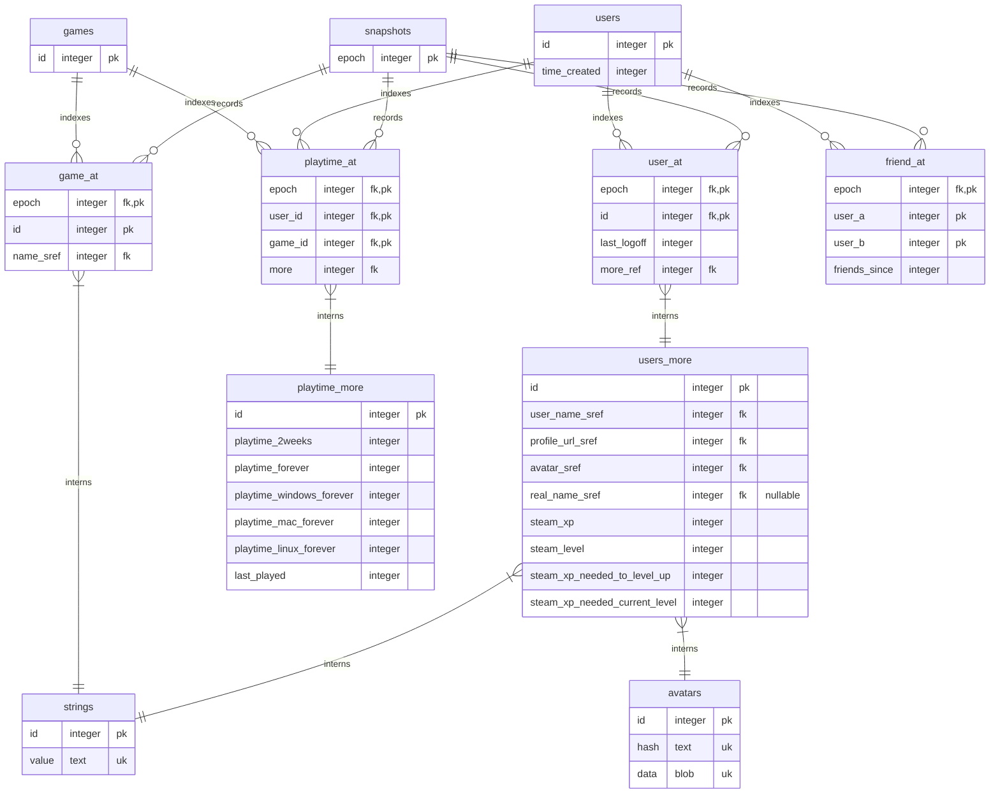

# Architecture Document (v2.0.0)

## Database

Assume `not null` unless specified.

```mermaid
erDiagram
   strings {
      id integer pk
      value text uk
   }

   snapshots {
      epoch integer pk
   }

   users {
      id integer pk
      time_created integer
   }

   snapshots ||--o{ user_at : records
   users ||--o{ user_at : indexes

   user_at {
      epoch integer fk,pk
      id integer fk,pk

      last_logoff integer
      more_ref integer fk
   }

   user_at }|--|| users_more : interns

   users_more {
      id integer pk

      user_name_sref integer fk
      profile_url_sref integer fk
      avatar_sref integer fk
      real_name_sref integer fk "nullable"

      steam_xp integer
      steam_level integer
      steam_xp_needed_to_level_up integer
      steam_xp_needed_current_level integer
   }

   users_more }|--|| strings : interns

   users_more }|--|| avatars : interns

   avatars {
      id integer pk
      hash text uk
      data blob uk
   }

   games {
      id integer pk
   }

   snapshots ||--o{ game_at : records
   games ||--o{ game_at : indexes

   game_at {
      epoch integer fk,pk
      id integer pk

      name_sref integer fk
   }

   game_at }|--|| strings : interns

   snapshots ||--o{ playtime_at : records
   users ||--o{ playtime_at : indexes
   games ||--o{ playtime_at : indexes

   playtime_at {
      epoch integer fk,pk
      user_id integer fk,pk
      game_id integer fk,pk

      more integer fk
   }

   playtime_at }|--|| playtime_more : interns

   playtime_more {
      id integer pk

      playtime_2weeks integer
      playtime_forever integer
      playtime_windows_forever integer
      playtime_mac_forever integer
      playtime_linux_forever integer
      last_played integer
   }

   snapshots ||--o{ friend_at : records
   users ||--o{ friend_at : indexes

   friend_at {
      epoch integer fk,pk

      user_a integer pk
      user_b integer pk

      friends_since integer
   }
```
